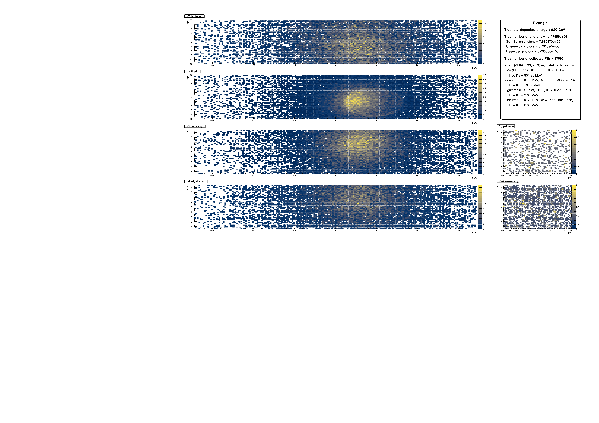

# Validate Analysis - Refactored Version

Validation analysis for comparing GENIE input files with RATPAC output files for the Theia 25 kt detector simulation. It also provides a framework for analysis of the RATPAC output files and an option for event display. The GENIE input files are organized in eight datasets corresponding to different simulated neutrino interaction channels (see Datasets below). The ROOT output file generated by this analysis has a lightweight simulation validation and basic, easily extendable, analysis of the RATPAC output (see Histograms below). One histogram per analysis type per dataset is produced. For each analysis type, an aggregate histogram combining all eight datasets is also produced. The ROOT file additionally contains a summary of the analysis configuration used for the specfic run and its filename includes a timestamp to avoid ambiguity between outputs.

## Quick Start
```bash
# 1. Setup environment

see INSTALL.md

cd /your/local/folder

# 2. Build
make

# 3. Run
./run_validate.sh              # Production: all datasets
./run_validate.sh debug        # Debug: dataset 4, file 4  - Creates Event displays
./run_validate.sh debug 8 55   # Debug: dataset 8, file 55 - Creates Event displays
```

## Directory Structure
```
validate/
├── validate.C              # Main analysis entry point
├── merge_datasets.C        # Histogram combination script
├── run_validate.sh         # Automation script
├── Makefile               # Build system
├── .rootlogon.C           # ROOT environment setup
├── README.md              # This file
├── INSTALL.md             # Detailed setup guide
├── include/               # Header files
│   ├── Config.h
│   ├── Statistics.h
│   ├── FileManager.h
│   ├── HistogramManager.h
│   ├── EventDisplay.h
│   └── EventProcessor.h
├── src/                   # Implementation files
│   ├── Config.C
│   ├── Statistics.C
│   ├── FileManager.C
│   ├── HistogramManager.C
│   ├── EventDisplay.C
│   └── EventProcessor.C
├── obj/                   # Compiled objects (created by make)
├── logs/                  # Log files (created by script)
└── Plots/                 # Event displays (created in debug mode)
```

## Usage

### Quick Reference
```bash
# Production mode (process all 8 datasets, create merged files)
./run_validate.sh

# Debug mode (single file, verbose output, event displays)
./run_validate.sh debug                  # Dataset 4, file 4 (default)
./run_validate.sh debug 1                # Dataset 1, file 4
./run_validate.sh debug 7 123            # Dataset 7, file 123

# Process specific dataset (production mode, all files)
./run_validate.sh dataset 3              # Process only dataset 3
```

### Datasets

| Number | Name | Description |
|--------|------|-------------|
| 1 | 01_FHC_NBE_NBM | FHC νe → μ appearance |
| 2 | 02_FHC_NBM_NBM | FHC ν̄μ → ν̄μ disappearance |
| 3 | 03_FHC_NUE_NUM | FHC νe → νμ appearance |
| 4 | 04_FHC_NUM_NUM | FHC νμ → νμ disappearance |
| 5 | 05_RHC_NBE_NBM | RHC νe → μ appearance |
| 6 | 06_RHC_NBM_NBM | RHC ν̄μ → ν̄μ disappearance |
| 7 | 07_RHC_NUE_NUM | RHC νe → νμ appearance |
| 8 | 08_RHC_NUM_NUM | RHC νμ → νμ disappearance |

## Output Files

### Production Mode (`./run_validate.sh`)

- `validate_0X_CHUNKNAME_TIMESTAMP.root` - Individual dataset outputs (one per dataset)
- `validate_merged_all_TIMESTAMP.root` - All datasets merged together
  - Contains histograms for each dataset: `h2d_ioTotalEnergy_01`, `h2d_ioTotalEnergy_02`, etc.
  - Contains combined histograms: `h2d_ioTotalEnergy_combined`, `h2d_ioSingleEnergies_combined`, etc.
- `validate_merged_dataset_0X_TIMESTAMP.root` - Per-dataset merged files
- `logs/*.log` - Processing and merge logs

### Debug Mode (`./run_validate.sh debug [DS] [FILE]`)

- `validate_0X_CHUNKNAME_TIMESTAMP.root` - Single file output
- `Plots/event_NNNNNN.pdf` - Event display PDFs (one per event in the file)
- `logs/validate_dataset_X_TIMESTAMP.log` - Detailed processing log

## Event Display Overview

<p align="center">
  <br>
  <em>Single event display showing detected PEs. 1 bin = 1 PMT</em>
</p>

### Histograms

Each output file contains:

- `h2d_ioTotalEnergy_0X` - GENIE vs RATPAC total kinetic energy
- `h2d_ioSingleEnergies_0X` - GENIE vs RATPAC per-particle kinetic energy
- `h2d_oPhotonsVsKE_0X` - Total photons vs kinetic energy
- `h2d_oCherenkovPhotonsVsKE_0X` - Cherenkov photons vs KE
- `h2d_oScintPhotonsVsKE_0X` - Scintillation photons vs KE
- `h2d_oRemPhotonsVsKE_0X` - Reemitted photons vs KE
- `h2d_oPEsVsKE_0X` - Photoelectrons vs KE

Where X is the dataset number (1-8).

The merged file also contains combined versions: `*_combined` (sum of all 8 datasets).

## Performance

### Optimizations

- **Branch reading**: Only essential branches are read in production mode (10-100x speedup)
- **Memory management**: Vectors pre-allocated, proper cleanup
- **Batch processing**: No GUI windows in production mode
- **Parallel execution**: Can run multiple datasets simultaneously (see INSTALL.md)

## Features

### Modular Design
- Each component has a single, well-defined responsibility
- Easy to understand, modify, and extend
- Classes can be reused in other analyses

### Statistics Tracking
Comprehensive statistics are collected and reported:
- Number of files processed/failed
- Number of events analyzed
- Energy matching statistics
- Validation metrics

### Event Displays
When enabled (debug mode only):
- 6 detector face views (top, bottom, left, right, upstream, downstream)
- PE counts per PMT shown as 2D histograms
- Event summary with particle information
- Saved as PDFs in `Plots/` directory

### Branch Optimization
In production mode, only reads:
- Event ID and subev
- Particle counts and energies
- Photon counts (scint, Cherenkov, reemitted)
- PE counts

## Troubleshooting

### Compilation Errors
```bash
# ERROR: RATROOT not set
export RATROOT=/path/to/rat
source /path/to/rat/setup.sh

# ERROR: ROOT not found
source /path/to/root/bin/thisroot.sh

# ERROR: cannot find libRATEvent
# Check that RATROOT is correct and RAT is compiled
ls $RATROOT/lib/libRATEvent.so
```

### Runtime Errors
```bash
# "ERROR: input tree 'T' not found"
# → Check input file format and path

# "ERROR: output tree 'output' not found"
# → Check output file format and path

# "WARNING: meta tree not found"
# → Event display won't work, but analysis continues

# Segmentation fault
# → Check .rootlogon.C is present and correct
# → Verify all libraries load successfully
```

### Performance Issues
```bash
# Slow processing?
# 1. Use production mode (debug=false)
./run_validate.sh

# 2. Check disk I/O (network filesystems are slow)
# 3. Run datasets in parallel (see INSTALL.md)
```

## Advanced Usage

### Direct ROOT Usage
```bash
# After make, you can call validate() directly in ROOT
root -l
root [0] validate(1, false, false)      # Dataset 1, production mode
root [1] validate(4, true, true, 100)   # Dataset 4, debug, file 100
```

### Custom File Processing
```cpp
// Edit validate.C to change:
// - Number of files to process
// - Starting file number
// - Output file naming
```

### Adding New Histograms

See INSTALL.md section "Adding New Histograms"

## Contact

- **Email**: mattia.fani@cern.ch

## References

- GENIE: https://github.com/GENIE-MC/Generator
- RATPAC: https://github.com/rat-pac/ratpac-two; more importantly: https://ratpac.readthedocs.io/en/latest/users_guide/overview.html
- Theia: https://theia.lbl.gov/

## License

GNU General Public License v3.0
